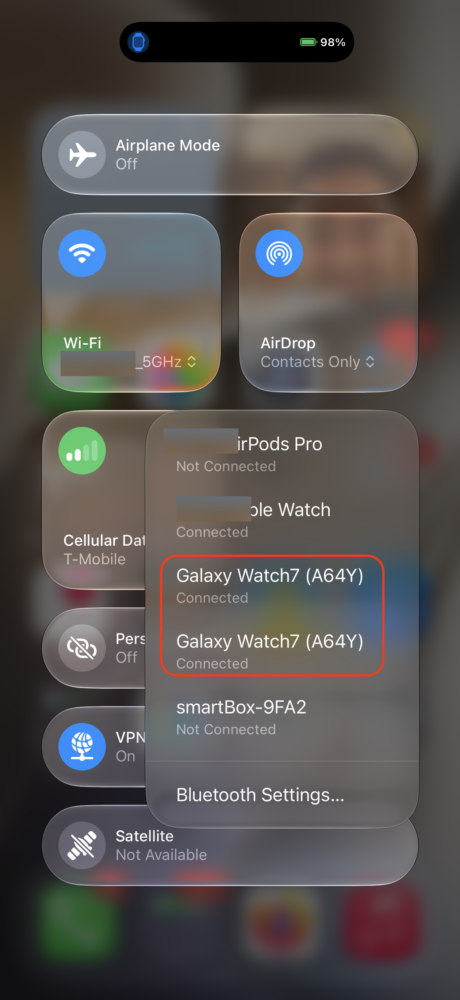
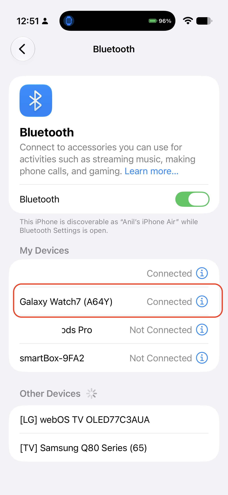
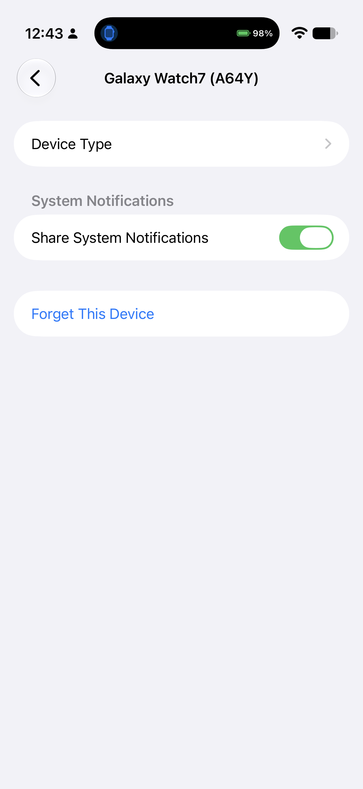
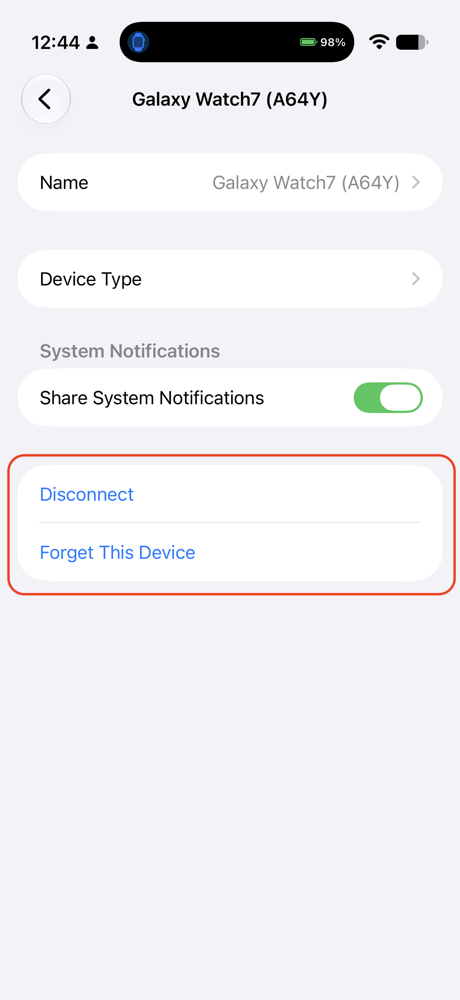

# Enabling Phone Calls on Wear OS via iPhone (Call Handling Guide) 📞

This guide explains how to enable and manage phone calls on your Wear OS watch when paired with an iPhone using the **Bridge** app.

---

## ⚡ TL;DR

To answer and make phone calls directly on your Wear OS watch:

1. On your iPhone, swipe down to open **Control Center**.
2. Long-press the **Connectivity widget** (Wi-Fi/Cellular/Bluetooth block), then long-press the **Bluetooth** icon.
3. You will see **two entries** with your watch's name:
   - One entry shows **Connected** (Bluetooth Low Energy / Bridge data sync).
   - The other entry shows **Not Connected** (Classic Bluetooth audio for phone calls).
4. Tap the **Not Connected** entry to connect it.
5. Once both entries display **Connected**, phone call routing to your watch speaker and microphone is fully enabled!
   

     
   

---

## 🔍 Understanding Classic Bluetooth vs. Bluetooth Low Energy (BLE)

When using Bridge with your iPhone and Wear OS watch, two distinct Bluetooth modes are involved:

### 1. Bluetooth Low Energy (BLE)
- **Used by the Bridge App:** Bridge relies on BLE for data synchronization, notification mirroring (via Apple Notification Center Service / ANCS), health & fitness metrics, media controls, and contact sync.
- **Ultra-Low Power Consumption:** BLE is designed to stay connected continuously throughout the day in the background with negligible battery impact on both your iPhone and your watch.

### 2. Classic Bluetooth (BR/EDR - Hands-Free Profile / HFP)
- **Used for Voice Calls:** High-bandwidth voice audio (microphone and speaker streaming) requires the Classic Bluetooth Hands-Free Profile (HFP).
- **Higher Power Consumption:** Classic Bluetooth audio connections consume noticeably more battery than BLE.
- **Operating System Controlled:** Third-party iOS apps (including Bridge) **have no programmatic control over Classic Bluetooth mode**. iOS and Wear OS manage Classic Bluetooth audio connections strictly at the system level.
- **Why Manual Reconnection Is Needed:** To optimize battery life, the operating system may put the Classic Bluetooth link on standby or disconnect it when not in an active call. When you want to handle calls on your watch, you can quickly reconnect Classic Bluetooth from iOS.

---

## 📱 Step-by-Step Instructions

You can connect Classic Bluetooth for calls using either the **iOS Control Center** (fastest) or the **iOS Settings App**.

### Method 1: Reconnecting via iOS Control Center (Recommended ⚡)

1. Open **Control Center** on your iPhone (swipe down from the top-right corner on iPhone X or later).
2. Long-press the top-left connectivity tile, then long-press the **Bluetooth** icon to view all paired devices.
3. Notice your watch appears twice in the list:
   - **Connected:** The active BLE connection used by Bridge.
   - **Not Connected:** The Classic Bluetooth profile for calls.

   

     
   

4. Tap the **Not Connected** watch entry.
5. Both entries will now show **Connected**. Call handling is now ready on your watch!

   

     
   

---

### Method 2: Reconnecting via iOS Settings

1. Open the **Settings** app on your iPhone and tap **Bluetooth**.
2. Under **My Devices**, locate your watch (e.g., `Galaxy Watch7`).

   

     
   

3. **Before Connection:** If only BLE is connected, tapping the `(i)` info icon shows basic settings with only *Share System Notifications* and *Forget This Device* (no *Disconnect* button).

   

     
   

4. Tap your watch in the device list to initiate the Classic Bluetooth connection.
5. **After Connection:** Once connected, the device detail screen will display full device controls, including the **Disconnect** option.

   

     
   

---

## ❓ Frequently Asked Questions (FAQ)

### Why do I see two identical entries for my watch in iOS Bluetooth?
One entry represents the **Bluetooth Low Energy (BLE)** connection managed by the Bridge app for notifications, health sync, and remote controls. The second entry represents the **Classic Bluetooth (HFP)** connection used exclusively by the OS for routing phone calls and audio.

### Why can't the Bridge app automatically maintain the call connection?
Apple's iOS security architecture and Bluetooth frameworks do not permit third-party apps to initiate or control Classic Bluetooth Hands-Free Profile (HFP) audio connections. This functionality is strictly handled by the iOS and Wear OS operating systems.

### Does keeping Classic Bluetooth connected affect battery life?
Yes. Classic Bluetooth streaming uses more power than BLE. If you prioritize maximum battery life, you can leave Classic Bluetooth disconnected during normal daily use (Bridge will continue syncing all notifications and data over BLE) and connect Classic Bluetooth via Control Center when you wish to take calls from your watch.

### What should I check if calls still don't ring on the watch?
1. Verify that both entries for your watch show as **Connected** in iOS Control Center or Bluetooth Settings.
2. On your Wear OS watch, open **Settings → Connectivity → Bluetooth**, tap on your paired iPhone, and ensure that **Phone audio / Calls** is toggled on.
3. Ensure that "Do Not Disturb" or "Theater Mode" is not actively muting call alerts on your watch.

---

## 💬 Support & Community

If you have questions, feedback, or need troubleshooting assistance:
- **Email Support:** [bridge@olabs.app](mailto:bridge@olabs.app)
- **Reddit Community:** [r/orienlabs](https://www.reddit.com/r/orienlabs/)
- **Website:** [olabs.app](https://olabs.app)
